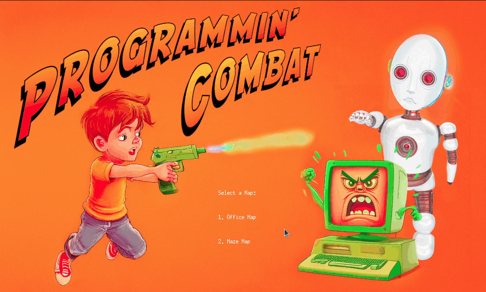
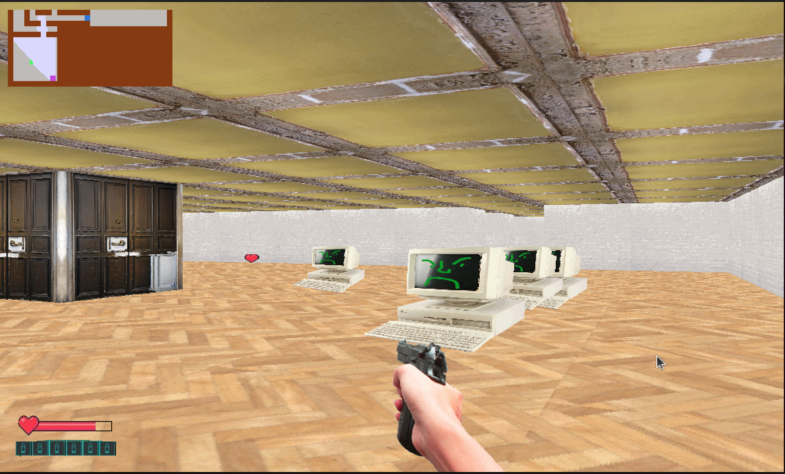
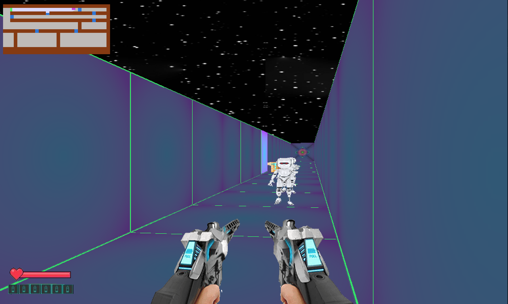

Cub3D - Raycasting FPS Game

🚀 Overview
Cub3D is a Wolfenstein 3D-inspired game that utilizes raycasting to create a pseudo-3D environment. 
The game features map exploration, sprite interactions, and an interactive minimap.

🤝 Collaborator
This project was made possible through the collaboration of:
  - 🧠 **@Berryfeels**

--------------------------------------------------------------------------------------

Tutorials for learning RayCastin

    Tutorial (1): https://lodev.org/cgtutor/raycasting.html

    Tutorial (2): https://permadi.com/1996/05/ray-casting-tutorial-table-of-contents/

--------------------------------------------------------------------------------------

🛠️ Mandatory Features
    ✅ Basic Rendering
      Raycasting-based 3D environment.
      Wall rendering without collision detection.
      Flat colors for the sky and floor (no textures).

    ✅ Player Movement
      Free movement within the map.
      Basic rotation and directional movement.

    ✅ Map System
      .cub map file format defines the layout.

✨ Bonus Features
    🔹 Enhanced
        * Skybox texture for a realistic sky rendering ("SK" identifier in .cub file).
        * Ceiling texture for immersive indoor environments ("C" identifier in .cub file).
        * Textured floors for better aesthetics.
        * Minimap for better navigation.
        * Rotating with mouse.
        * Sliding doors.

    🔹 Combat & Enemies
        * Weapon system
        * Left Control key to shoot.
        * Bullets deal damage to sprites.
        * Enemy AI (Sprites)
        * 2D moving sprites that chase the player.
        * Enemies cause health damage upon contact.

    🔹 Game HUD & Objective
        * Player health displayed at the lower-left corner of the screen.
        * Player ammo displayed at the lower-left corner of the screen.

    🔹 Objective:
        * Find the key 🔑. (Gold square in minimap)
        * Unlock the final door 🚪. (Green square in minimap)

--------------------------------------------------------------------------------------

--------------------------------------------------------------------------------------

🎮 Controls

| Action                 | Key           |
|------------------------|---------------|
| Move Forward           | W             |
| Move Backward          | S             |
| Turn Left              | A             |
| Turn Right             | D             |
| Shoot                  | Left Control  |
| Door open/close        | Space         |
| Exit Game              | ESC           |

--------------------------------------------------------------------------------------
Requirements for MacOS

Xquartz

        Brew install Xquartz
        reboot
        xeyes
  
  To run the program on Linux/MacOs

- Clone the Git repository.
- Navigate into the repository folder.
- Execute the `run.sh` script by running:
  ./run.sh
- Wait for the program to be built.
- In the popped-up window, select one of the two map designs by pressing "1" or "2".

To clean the program:
- Execute the `clean.sh` script by running:
  ./clean.sh
---------------------------------------------------------------------------------------
GamePlay

----------------------------------------------------------------------------------------
Screenshots

From the first popup/start window, you can select between two maps

First design :
    Offic design with old computers as enemy.
 

Second design :
    Space/futuristic design with robots as enemy.
 

